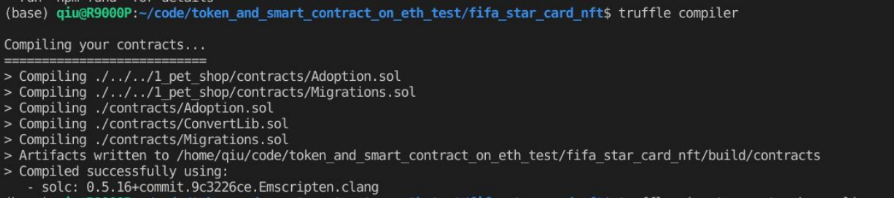

## FIFA star card NFT

| Time       | Author                  | Course   |
| ---------- | ----------------------- | -------- |
| 2023/12/11 | Kaitao Qiu, Yinfan Shao | CMPT 789 |

[TOC]

## How to run this project

1. Input your own infura api key in file `./src/js/app.js`

   

2. install truffle framework

   ```bash
   npm install -g truffle
   ```

3. compile smart contract

   ```bash
   truffle compiler
   
   # Compiling ./contracts/...
   # Writing artifacts to ./build/contracts
   ```

   
   

4. deploy smart contract

   ```bash
   # depoly your smart contract into eth sepolia testnet
   truffle mirgrate --network sepolia
   ```

   
   

5. [Optional] Test your smart contract

   ```bash
   truffle test
   # 3 passing ...
   ```

6. Install npm package

   ```bash
   npm install
   ```

   It will install necessary package in node_modules

7. run frontend website

   ```bash
   npm run dev
   ```

   

   

   

   


## File structure

- contracts/ :Folder for smart contracts, all smart contract files are placed here, including an important contract Migrations.sol .

- migrations/ :Used for handling the deployment (migration) of smart contracts. Migration is an additional special contract used to keep track of contract changes.

- test/ :Folder for smart contract test cases.

- truffle.js/ :Configuration file.
- src/: front-end code and the interactive logic

## Demo

https://drive.google.com/drive/folders/1SQVPzr9JaknnmcptvA15Sq9xz8BY80wH?usp=sharing

```
789 slides token and smart contract.pdf: slides of this presentation
demo smart_contract_token_NFT_video.webm: demo video
789 presentation 2023.12.04.mp4: presentation video
```


